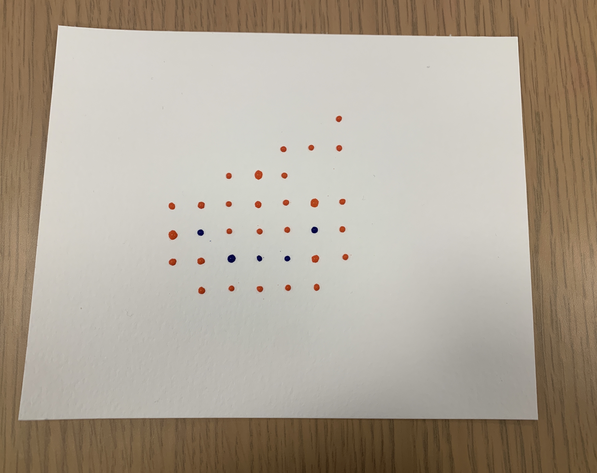

# PyLabRobot Art Studio

**See [artstudio.pylabrobot.org](https://artstudio.pylabrobot.org).**

Art Studio for [PyLabRobot](https://github.com/pylabrobot/pylabrobot): getting creative with 96 well plates, waterpaint, and liquid handling robots.

Art studio:


Master dashboard:


## Gallery




## Developers

**NOTE: This is a demo project**:

- It uses long polling.
- Artworks/pieces/submissions are passed around inefficiently.

```bash
# on a server, serves studio
TOKEN="secret" python server.py

# on computer with robot, serves dashboard and controls robot
TOKEN="secret" python executor.py
```

---

_This project was developed for the Sculpting Evolution Group, to present at the Media Lab's Members Meeting, Fall 2022_
